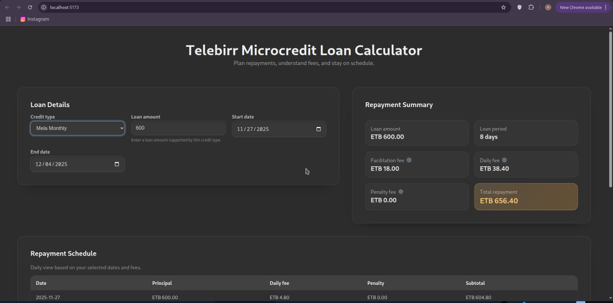
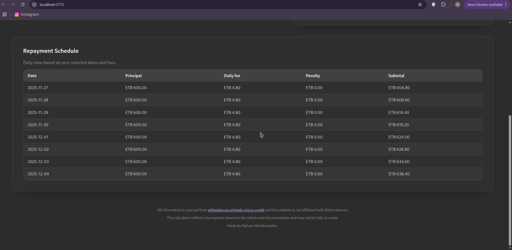

# Telebirr Credit Calculator

A web application for calculating and managing Telebirr credit transactions with detailed statistics and reporting.

## Features

- Calculate credit transactions with various parameters
- View detailed statistics and reports
- User-friendly interface
- Responsive design for all devices

## Tech Stack

### Frontend
- React with TypeScript
- Tailwind CSS for styling
- React Router for navigation
- Axios for API requests
- React Icons for UI icons

### Backend
- NestJS (TypeScript)
- Class-validator for request validation
- RESTful API architecture

## Screenshots

### Main Interface

### Statistics

## Getting Started

### Prerequisites

- Node.js
- npm or yarn

### Installation

1. Clone the repository
2. Install dependencies for both frontend and backend
3. Start the development servers

## License

This project is licensed under the MIT License - see the [LICENSE](LICENSE) file for details.
